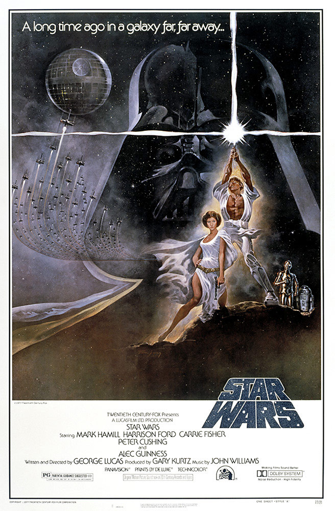
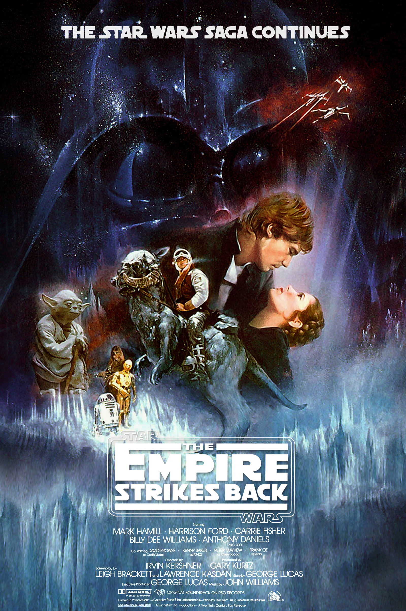
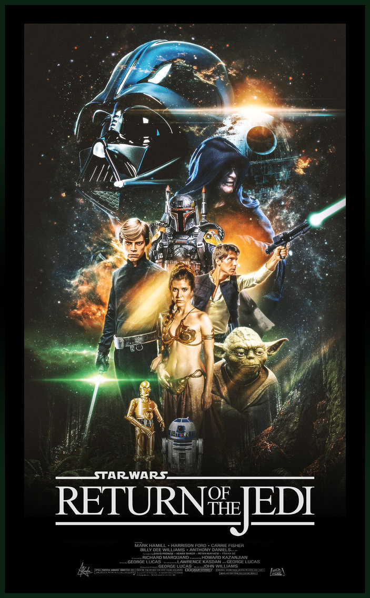
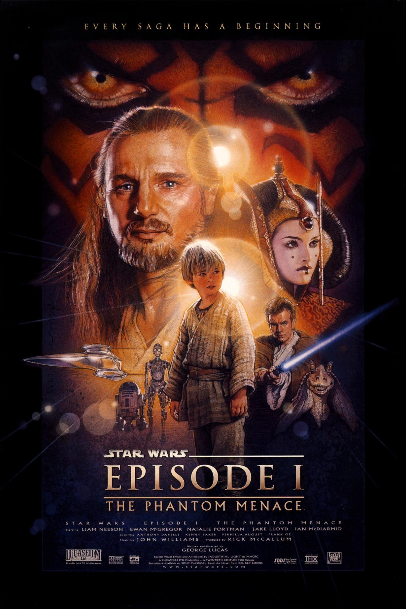
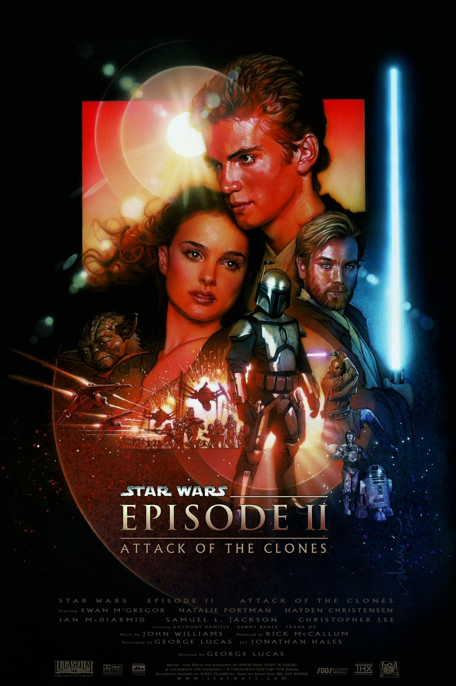
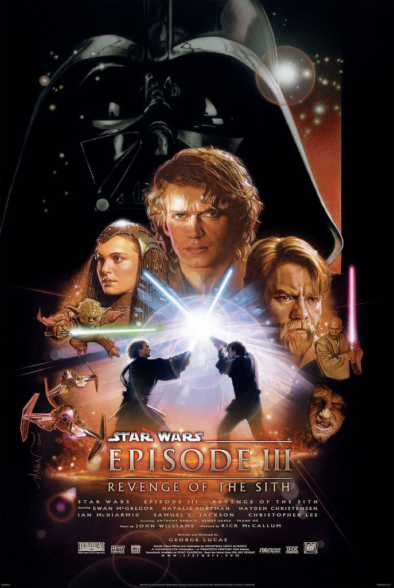
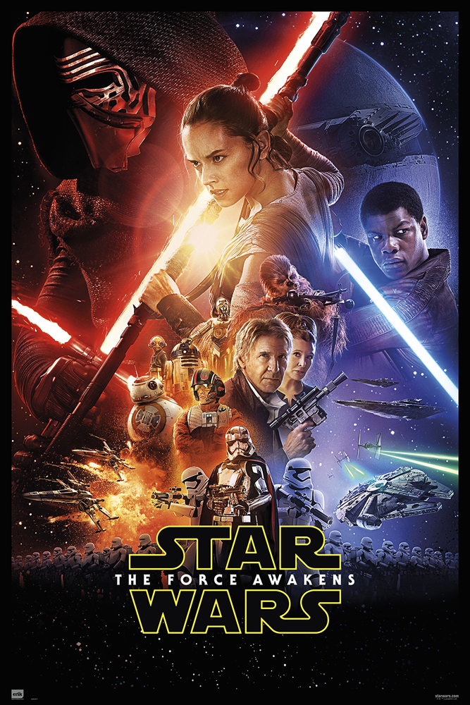
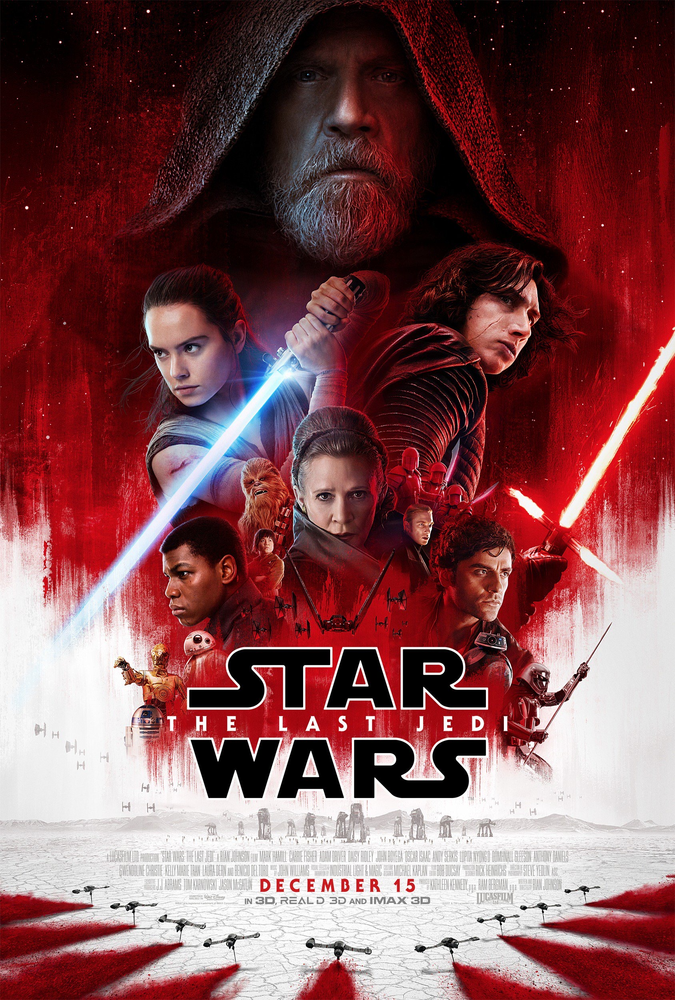
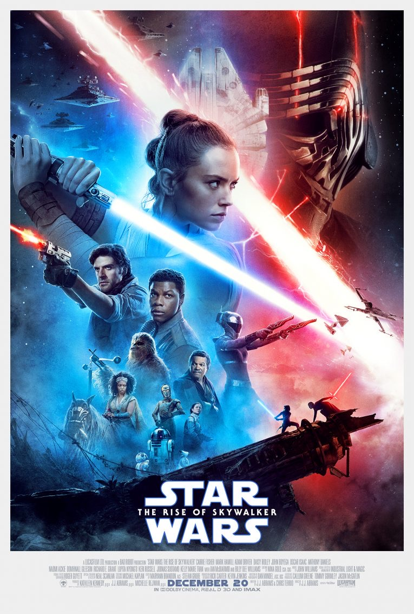

# A long time ago in a galaxy far, far away...

\
Más de 4 décadas han transcurrido desde que George Lucas creara el Space-Opera conocido mundialmente como **Star War**, introduciendo nuevos terminos como _The Force_, _lightsabers_, _droids_, _Sith_ entre mucho más.

La saga de Skywalker llega a su fin este 20 de Diciembre, con el estreno de **Episodio IX - The Rise of Skywalker**

A continuación los _Posters_ oficiales de cada película (en su orden de lanzamiento conocido por la comunidad de fans como _Machete Order_).

## Episode IV - A New Hope (1977)

## Episode V - The Empire Strikes Back (1980)

## Episode VI - Return of the Jedi (1983)

## Episode I - The Phantom Menace (1999)

## Episode II - The Attack of the Clones (2002)

## Episode III - Revenge of the Sith (2005)

## Episode VII - The Force Awaken (2015)

## Episode VIII - The Last Jedi (2017)

## Episode IX - The Rise of Skywalker (2019)

