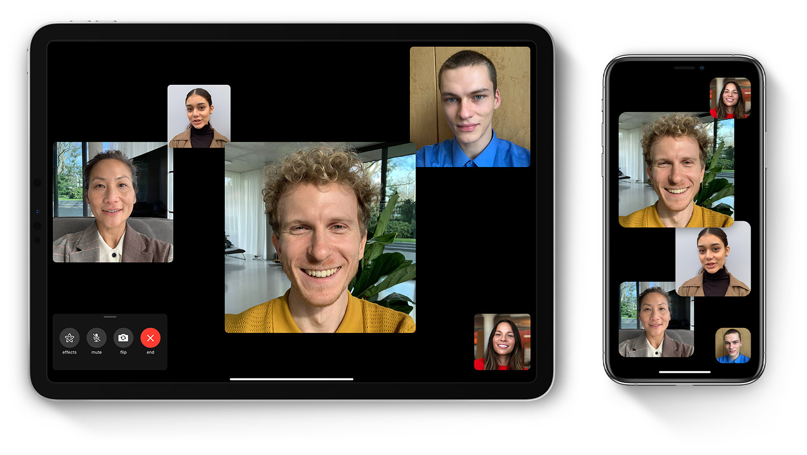

# Everything is gonna be fine…

\
Cerca de cumplir 5 meses desde que se detectaron los primeros casos de Coronavirus en el China, podríamos decir que el planeta esta sufriendo de la misma manera los efectos de esta pandemia.

- Aislamiento Social
- Cuarentena
- Ansiedad

En definitiva el cambio que estamos pasando por el periodo de COVID-19 va a estar presente por mucho tiempo para bien y para mal.
Miles de organizaciones se vieron forzadas en la implementación de prácticas de trabajo remoto (WFH) de la noche a la mañana, muchas sin capacidad para llevar su operativa perdiendo el paso con el que venían avanzando.

Otras no tan afortunadas se vieron forzadas en realizar un alto en sus operaciones al no contar con la demanda de clientes o por regulaciones locales. Generando una oportunidad para la innovación y nuevas estrategias con el objetivo de salir adelante, por que todo es momentáneo.

# Interacción en un mundo virtual

\
En un abrir y cerrar de ojos, nuestro mundo se encapsulo dentro de nuestros dispositivos móviles como único medio para poder interactuar con nuestro amigos y familiares. Gracias a estas plataformas podemos batallar contra el sentimiento de aislamiento y soledad.

Estas son algunas de las que he utilizado en los últimos meses:

## Zoom

[Zoom](www.zoom.us “Zoom”) \
El principal beneficiado durante este periodo incrementando su base de usuarios de 10 Millones a 200 Millones DAU (Daily Active Users)

## FaceTime & Whatsapp

Método más simple de interactuar con nuestros seres queridos, en la mayoría de casos presentes de manera determinada en nuestros dispositivos.

## HouseParty

[HouseParty](www.houseparty.com “HouseParty”) \
Con una simple interfaz y el principal atractivo de poder entretenerse con varios juego como Heads Up, Trivia, Quick Draw!

Stay safe!
